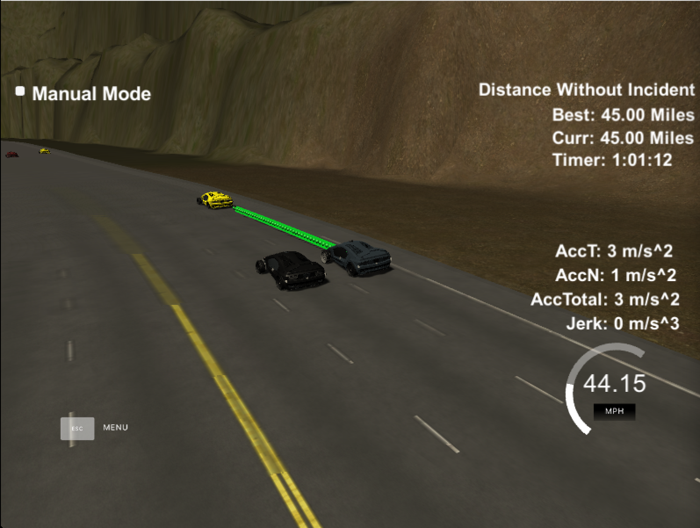

# Path planning project

The car was able to drive around track for at least 45 miles without incidents. The video with first 8 miles is attached.

## Start

For the first step in the project I have decided to go around the map.
To achieve this, I have done two simple steps: first, use the waypoints
and given function `getXY` as well as `s` coordinate of the car with fixed `d` coordintate.
This resulted in simple way around the track with multiple problems, the first of which
was approximation with given function. To solve the problem, I have chosen
three points ahead of the car and fitted the polynomial to it. The polynomial was chosen
instead of offered spline lib due to lower curvature, resulting in less precise, but more smooth trajectory.

However, simple fit was not enough, as in points where waypoints have overlapping x coordinate
certain problem arised. Therefore, I have decided to translate the coordinate space to the car viewpoint, which solved many problems and helped
in further development.

## Speed control

To incorporate speed control, as well as smooth de/acceleration, I have used simple gradual increase of the speed based on speed limit and frequency of updates (0.02 seconds).
While generating the trajectory, the decision of speed affects the frequency of the waypoints generated.
The car calculates the speed of the other cars in the lane and tries to follow them using it. 

## Smooth traejctory

Though polynomial have provided good and smooth trajectory, there still were some problems 
in following it due to lack of synchronization between updates of path and actual movement.
The simulator is providing previous path given to it, so I have reused waypoints from there and achieved smooth trajectory.
However, the practice have shown that reusing the whole path is not the best idea, as the reaction time of the car decreases a lot.
Therefore, I have found a balance between the smoothness and reaction time using only half of previous path.

## Changing lanes

The lane change was the last and most complicated issue to solve. First, I have tried to apply finite state machine with predictions and certain costs,
but it has shown itself ineffective due to love of the simulated vehicles to unexpected instant change of speed in the crowd.

Therefore, I decided to mimic the simplest driver's behaviour using simple set of rules.
- If we are approaching the car, consider changing lanes.
- If there is an empty lane - change there.
- If the lane has any cars, consider switching only if there is some free buffer between them.

Without preparations to change lanes the behaviour was more consistent and reactive.
Moreover, polynomial and its smoothness allowed to avoid problems with turns.

## Further improvements
Although the car is able to drive somehow efficiently and navigate through environment,
its capabilities are still low. To improve this, I would suggest to introduce search through environment instead of current greedy one.
Moreover, for better control over speed and acceleration, solution similar to JMT are essential, as 
currently I wasn't using the car potential to go through the lanes.
Last, but not the least, the prediction of the car and environment state would allow to process
and optimize the trajectory even further.